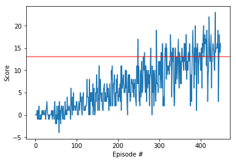

# Project 1: Navigation Report

## Introduction

This project was made as a part of the Deep Reinforcement Learning Nanodegree. 
A DQN agent is trained to navigate an environment and collect bananas. Unity environment is used for training. 
The code is written in Python 3 and Pytorch.

## Agent

- As mentioned before the agent is a DQN agent built using Pytorch. 
- A simple two hidden-layer neural network is used to train the agent.
- The Network Architecture looked like this: 
    - **State => (64 + ReLU) => (128 + ReLU) => (64 + ReLU) => Actions**

- Parameters:

    - **`Epsiodes`** - Max number of training episodes: 2000.
    - **`Learning Rate`** - Used a learning rate of 5e-3.
    - **`Timesteps`** - Max Timesteps per episode: 1000.
    - **`Buffer Size`** - Used a buffer of size 1e5.
    - **`Activation`** - Used Rectified Linear Unit. 
    - **`Batch Size`** - Used a batch size of 64.
    - **`Tau`** - Parameter for Soft-Updates.
    - **`C`** - Parameter for model updates.
    - **`Optimizer`** - Used Adam Optimizer.
    - **`Gamma`** - Discount Factor.

## Training
- `Navigation.ipynb` can be used to train the agent and play around with the environment.
- The agent was able to solve the environment in ~349 episodes.
- The training plot looked like this:

## Future Work
- I plan on implementing Prioritized Replay Buffer and evaluate the change in performance.
- Following this I wish to try out Double and Deuling DQN architectures.
 - Finally I want to experiment with learning directly from pixels.
    
    